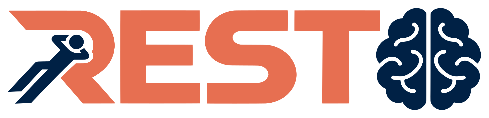

<div align="center">

<picture>
  <source media="(prefers-color-scheme: dark)" srcset="assets/rest-logo-dark.svg">
  
</picture>

# Principled Thoughts for Latent Recursive LLM Systems

**Fahd Seddik** · **Fatemeh Fard**

FARD Lab, University of British Columbia

<a href="https://fard-lab.github.io/REST/"></a>
<a href="LICENSE"></a>

</div>

---

This repository contains the code for REST (REpresentation-Supervised Thoughts).
REST trains the latent handoff between frozen LLM agents with cross-entropy plus a β-weighted property loss on the transferred thought (causality, minimality, separability, stability).
It also contains the CODI and SIM-CoT baselines, adapted as loss terms in the same framework.

## Layout

| Path | Contents |
|---|---|
| `src/rest/axioms/` | Property loss terms and the CODI and SIM-CoT baseline terms |
| `src/rest/multi_agent/` | Planner, refiner and solver training (`train.py`) and evaluation (`evaluate.py`) |
| `src/rest/single_agent/` | Solver self-loop training (`train.py`) and evaluation (`evaluate.py`) |
| `src/rest/recipe.py` | Fixed training data, base models and inner adapters of each system |
| `src/rest/frozen_baseline.py` | Evaluation of a frozen base LLM with no system |

## Setup

The code needs Linux, an NVIDIA GPU with a CUDA 13 driver, `git`, and [uv](https://docs.astral.sh/uv/).

```bash
./setup.sh
```

The script clones [RecursiveMAS](https://github.com/recursivemas/recursivemas) at a pinned commit into `refs/recursive_mas` and creates the environment with `uv sync`.
Our code imports the base training utilities, prompts and evaluation harness from that checkout.

Llama 3.2, Gemma 3 and GPQA-Diamond are gated on the Hugging Face Hub.
Set `HF_TOKEN` to a token from an account that has access to them.

The Scaled solver (Qwen3.5-4B) runs faster with `flash-linear-attention` and `causal-conv1d` installed.
Without them, `transformers` falls back to a slower PyTorch implementation of its linear-attention layers.

## Systems

| System | Planner | Refiner | Solver | `--style` |
|---|---|---|---|---|
| Light | `Qwen/Qwen3-1.7B` | `meta-llama/Llama-3.2-1B-Instruct` | `Qwen/Qwen2.5-Math-1.5B-Instruct` | `sequential_light` |
| Scaled | `google/gemma-3-4b-it` | `meta-llama/Llama-3.2-3B-Instruct` | `Qwen/Qwen3.5-4B` | `sequential_scaled` |

## Fixed settings

`--style` is the only choice of system.
It selects the base models above, and `src/rest/recipe.py` fixes everything else the paper holds constant.

- Every run trains on `RecursiveMAS/Sequential-Math`, and that single checkpoint is evaluated on all math, science and code benchmarks.
- Each agent starts from its pretrained math inner adapter in the RecursiveMAS model of the chosen `--style`.
- The inner and outer adapter types are fixed.

The inner adapters download on first use and are staged under `adapters/`.

## Multi-agent

Train the outer links of the Light system with minimality at β = 0.3.

```bash
uv run python -m rest.multi_agent.train \
    --style sequential_light \
    --num_recursive_rounds 1 \
    --batch_size 4 \
    --axiom minimality --axiom_weight 0.3 \
    --seed 42 \
    --save_dir outputs/multi_light_minimality
```

Evaluate the trained outer links.

```bash
uv run python -m rest.multi_agent.evaluate \
    --style sequential_light \
    --dataset math500 \
    --num_recursive_rounds 1 \
    --latent_length 32 \
    --batch_size 8 \
    --seed 42 \
    --outer_dir outputs/multi_light_minimality \
    --result_jsonl outputs/multi_light_minimality/math500.jsonl
```

The planner, refiner and solver resolve to the public RecursiveMAS models of the chosen `--style`, and only the outer links come from `--outer_dir`.
For each benchmark the harness loads those models' frozen inner adapters for its domain, the code adapters on `mbppplus` and `livecodebench` and the math adapters elsewhere.
`--dataset` takes `math500`, `aime25`, `aime26`, `gpqa`, `medqa`, `mbppplus` or `livecodebench`.
We use `--batch_size 1` on `aime25` and `aime26`, which report pass@10 over ten rollouts.
Each record carries `num_tokens`, the latent steps plus the decoded solver tokens.
On pass@10 benchmarks the count sits on each rollout record, and the first rollout carries the latent steps.

## Single-agent

Train the solver self-loop of the Light system with minimality at β = 1.0.

```bash
uv run python -m rest.single_agent.train \
    --style sequential_light \
    --num_recursive_rounds 1 \
    --batch_size 4 \
    --axiom minimality --axiom_weight 1.0 \
    --seed 42 \
    --save_dir outputs/single_light_minimality
```

Evaluate it.

```bash
uv run python -m rest.single_agent.evaluate \
    --style sequential_light \
    --outer_checkpoint_dir outputs/single_light_minimality \
    --eval_dataset math500 \
    --num_recursive_rounds 1 \
    --latent_steps 32 \
    --batch_size 4 \
    --result_jsonl outputs/single_light_minimality/math500.jsonl
```

`--eval_dataset` takes the same names as the multi-agent `--dataset`.
Code benchmarks use the same checkpoint and the same math solver adapter.

## Loss terms

| Setting | Flags |
|---|---|
| CE only | `--axiom none --axiom_weight 0` |
| One property | `--axiom causality --axiom_weight 0.3` (or `minimality`, `separability`, `stability`) |
| Composition | `--axiom causality minimality separability stability --axiom_weight 0.3 1.0 0.1 1.0` |
| CODI (multi-agent only) | `--axiom codi_kd --axiom_weight 20` |
| SIM-CoT (multi-agent only) | `--axiom simcot_step --axiom_weight 0.3` |

Names and weights pair by position.
In a composition, minimality drops its input-reconstruction term.
`--force_composed_form 1` applies that composed form to a single minimality run.
`--simcot_stages` limits the SIM-CoT step decoders to a subset of `planner`, `refiner` and `solver`.
The single-agent and multi-agent tables use `--num_recursive_rounds 1` or `3`, as stated in each caption, and evaluation must use the same value as training.

## Frozen base models

```bash
uv run python -m rest.frozen_baseline \
    --model_name_or_path Qwen/Qwen3-1.7B \
    --eval_dataset math500 \
    --result_jsonl outputs/frozen/qwen3_1.7b_math500.jsonl
```

## Outputs

Training writes the outer-link weights, any property-term state and `outer_adapter_config.json` to `--save_dir`.
`--save_steps N` also writes a resumable checkpoint every N steps, and `--resume_from <save_dir>/checkpoint-<step>` continues an interrupted run from one.
A run that finishes removes these intermediate checkpoints.
Evaluation writes one JSON record per question to `--result_jsonl`.
The single-agent and frozen evaluations end the file with a summary record.

## Acknowledgments

This code builds on [RecursiveMAS](https://github.com/recursivemas/recursivemas).
We use its training utilities, prompts, evaluation harness, pretrained agents and inner adapters, and its Sequential-Math training data.
We thank its authors for releasing them under the MIT License.
`setup.sh` fetches RecursiveMAS from its own repository at a pinned commit, and this repository does not redistribute any of its code.

## Citation

```bibtex
@misc{seddik2026principled,
  title  = {Principled Thoughts for Latent Recursive LLM Systems},
  author = {Fahd Seddik and Fatemeh Fard},
  year   = {2026},
  url    = {https://fard-lab.github.io/REST/}
}
```
